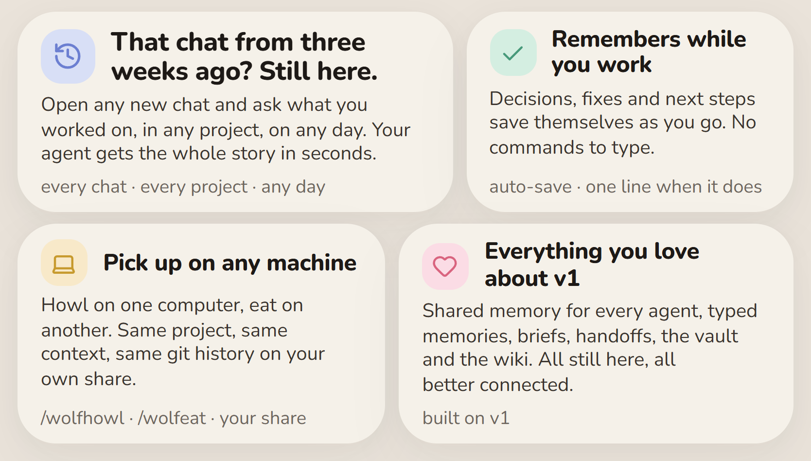

<p align="center">
  
</p>

<h1 align="center">Wolf Leader</h1>

<p align="center">
  <b>One memory for every AI agent you use. Now on autopilot.</b><br>
  Self-hosted · works with Cursor, Claude Code and anything that speaks MCP or HTTP
</p>

<p align="center">
  <a href="../../releases/latest"><b>Download for Windows or Mac</b></a> ·
  <a href="#easy-install">Install</a> ·
  <a href="#how-it-works">How it works</a> ·
  <a href="AGENTS.md#what-this-fork-does-differently-from-upstream">What's different in this fork</a>
</p>

---

Every AI chat starts from zero. Wolf Leader fixes that. It keeps a shared memory of your projects
(decisions, fixes, what's left to do) on a hub you run yourself, so any agent on any machine can
pick up where the last one stopped.

v1 got the hard part right: one shared memory for every agent, with briefs and handoffs that just
work. This update builds on it so the remembering happens on its own.

<p align="center">
  
</p>

## That chat from three weeks ago? Still here.

Open a brand-new chat in any project and ask:

> what did we work on in the billing service around March 3?

Your agent pulls the decisions, fixes and open work from that day and has the whole story in
seconds. No scrolling through old chats, no pasting context.

## How it works

You don't type commands. The installed rule tells your agent to do this in the background, and it
mentions each save in one short line:

| When | What the agent does |
|---|---|
| Chat starts | Finds the Wolf Leader project for this folder and loads its memories. If there isn't one, it asks before creating it. |
| Something durable happens | Saves it as a typed memory: `decision`, `constraint`, `problem`, `goal`, `active_work`, `note`, `caveat`. |
| After each meaningful step (at least every ~8 turns) | Checkpoints the session. Same chat ID means the same record is updated, and the chat stays in its project. |
| Anything unclear | Hub unreachable, two projects could match, a rename or merge: it tells you and asks. |

Each save runs the full pipeline on the hub: memories, embeddings, the project brief, an Obsidian
note and the wiki.

### Pick up on any machine

- **`/wolfhowl`** broadcasts a session: save, git state, file catalog and vault notes, then offers to
  commit, push to your share's git remote and index the files.
- **`/wolfeat`** pulls the latest context for this project onto another machine: brief, memories,
  recent howls with their git commits, and missing files from the share.

Project history lives on your own network share (`<share>/wolf-leader/git/<slug>.git`). No GitHub
account needed.

## Easy install

**Download** the installer from the [latest release](../../releases/latest), or from a clone:

| | |
|---|---|
| **Windows** | Double-click `start.bat`. It builds `dist\WolfLeaderSetup-<version>.exe` (installing Inno Setup if needed) and runs it. |
| **Mac** | Open the `.dmg` and drag **Wolf Leader** to Applications. Setup runs in the app on first launch, then it becomes your dashboard: stats, recent chats, projects, search, shares and updates. From a clone, double-click `start.command` or run `bash installer/mac/build-app.sh` (macOS 14+, Xcode or Command Line Tools). First launch: right-click → Open (macOS 15+: System Settings → Privacy & Security → Open Anyway). |

The wizard takes a few minutes:

1. **Do you already have Wolf Leader?** Connect to an existing hub (recommended), update this
   computer, or start a new hub here with Docker (experimental).
2. **What do you want?** Client skills and rule, network shares, Git and Python, Obsidian
   (recommended), the wiki (highly recommended).
3. **Ask your AI agent.** Copy the prompt into Cursor, Claude or ChatGPT on this computer. It backs
   up your current configs, checks what's installed and replies with a strict INI file
   ([format](installer/CONFIG.md)). Paste or load the reply.
4. **Share passwords.** Typed into the installer, never into the AI chat.
5. **Git name and email.** Real or made-up, so local commits never stop to ask for a GitHub login.
6. **Install.** Setup backs up everything it touches first and leaves a restore script to undo it.

## Run the hub

The hub is a Docker stack: FastAPI REST and web UI on `:6971`, MCP on `:6972/mcp`, Postgres with
pgvector, and a nightly backup.

```bash
cp .env.example .env                 # set IDE_STORAGE_PUBLIC_URL to how clients reach the hub
docker compose -f docker-compose.postgres.yml up -d --build
```

- **Tested setup:** an always-on box (NAS, Proxmox LXC or Linux server) with an SMB share for the
  vault, project mirrors, backups and git remotes. Walkthrough: [docs/lxc-hub.md](docs/lxc-hub.md).
- **Docker on your desktop** works the same way but is experimental: the hub is only up while your
  computer is.
- Already have chats? `scripts/wolf-backfill.py` imports existing Cursor and Claude Code sessions
  into grouped projects.
- Running the original Wolf Leader? The Mac app's setup spots it from your AI's answer and offers
  to upgrade the hub first, on this Mac or on the hub computer over SSH (key login only), and
  Settings > Hub offers Downgrade later. By hand: `bash scripts/wolf-og-migrate.sh` on the hub
  computer, before installing any client. It moves projects, chats and memories to the new hub,
  creates the share folders and leaves the original folder untouched.

Times shown to humans are local, `HH:MM MM/DD/YYYY`, using `WOLF_TZ`.

## Connect an agent by hand

```json
{
  "mcpServers": {
    "wolf-leader": { "url": "http://wolf.local:6972/mcp" }
  }
}
```

Then copy `examples/cursor/rules/wolf-leader-hub.mdc` into `~/.cursor/rules/` and the skills in
`examples/cursor/skills/` into `~/.cursor/skills/`. The installer does all of this for you.

| Port | Service |
|---|---|
| 6971 | REST API, web UI, agent brief URLs, wiki at `/wiki/` |
| 6972 | MCP tools at `/mcp` |

Useful endpoints: `GET /health`, `GET /api/search?q=…` (hybrid keyword and vector),
`GET /api/projects/{slug}/agent-brief`, `POST /api/projects/ensure`.

## Other ways to run

| File | Use |
|---|---|
| `docker-compose.postgres.yml` | Recommended: Postgres + pgvector, vault, wiki |
| `docker-compose.yml` | Lean SQLite, keyword-only search (Pi, small hosts) |
| `docker-compose.embeddings.yml` | Overlay that adds semantic search to the lean stack |
| `docker-compose.dev.yml` | Live-mount source for development |
| `run-local.sh` / `stop-local.sh` | No Docker: Python 3.11+ on one machine |

More detail: [INSTALL.md](INSTALL.md).

## Your data stays yours

Memories live in the hub's database on your own hardware. Nothing is sent anywhere else. The repo
never contains runtime data: `.env`, `data/` and the vault are gitignored. Back up the hub's data
folder (the Postgres stack does this nightly to the share).

## Credits

Built on [Wolf Leader](https://github.com/CorbinRandall/wolf-leader) by Corbin Randall. See
[AGENTS.md](AGENTS.md#what-this-fork-does-differently-from-upstream) for what this fork adds.
